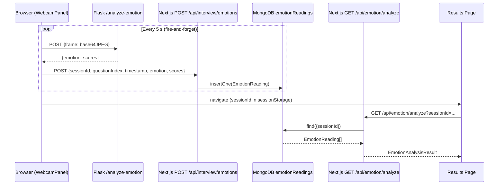

# Design Document: Emotion Analysis Integration

## Overview

This feature adds real-time facial emotion analysis to PrepHire's interview session. During an active interview, the browser captures a webcam frame every 5 seconds, sends it to a new Flask endpoint backed by EmotiEffLib (ONNX), and stores the returned emotion scores in MongoDB. After the interview, a Next.js analysis route reads all stored readings for the session and computes rule-based metrics that are displayed on the results page alongside the existing answer evaluation.

The design is intentionally fire-and-forget: no part of the emotion pipeline can block or disrupt the core interview flow. If the webcam is unavailable, denied, or lost at any point, the interview continues without any error state.

### Key Design Decisions

1. **Frame capture in the browser** — `setInterval` at 5 s fires `canvas.toDataURL('image/jpeg')` on the live `<video>` element. Canvas is capped at 640×480 to keep payload size small. The resulting base64 string is POSTed to Flask without awaiting the response.
2. **EmotiEffLib via ONNX** — The `enet_b0_8_best_vgaf` model is loaded once at Flask startup. It returns confidence scores for 7 emotion classes. Raw images are never stored or logged.
3. **Scores-only storage** — Only the numeric scores (and metadata) reach MongoDB. The `emotionReadings` collection is append-only during a session.
4. **Pure JS analysis** — The `GET /api/emotion/analyze` route reads all readings for a `sessionId` and applies the specified formulas entirely in JavaScript. No ML inference happens at analysis time.
5. **Session identity via UUID v4** — A `sessionId` is generated when the interview page initialises and flows through every emotion submission and into `sessionStorage` so the results page can retrieve the correct readings.
6. **fast-check for PBT** — The project already has `fast-check` in `devDependencies`. All property-based tests use it.

---

## Architecture



The Flask server runs on port 5000 (existing). The Next.js app runs on port 3000. CORS is already enabled on Flask via `flask-cors`.

---

## Components and Interfaces

### 1. `WebcamPanel` (modified)

**New props added:**

```typescript
interface WebcamPanelProps {
  domain: string;
  difficulty: string;
  questionCount: number;
  sessionTimeLeft: number;
  // NEW
  sessionId: string;
  currentQuestionIndex: number;
  isInterviewActive: boolean;
}
```

**New internal behaviour:**

- A `canvasRef` (`useRef<HTMLCanvasElement>`) is created but never rendered (off-screen).
- A `captureIntervalRef` (`useRef<NodeJS.Timeout | null>`) holds the `setInterval` handle.
- When `isInterviewActive` is `true` and the stream is live, `setInterval` is started at 5 000 ms.
- Each tick: draw `videoRef.current` onto the canvas (max 640×480), call `canvas.toDataURL('image/jpeg', 0.8)`, then fire-and-forget the two-step submission chain.
- When `isInterviewActive` becomes `false` (or the component unmounts), `clearInterval` is called and the stream is released.

**Frame submission chain (fire-and-forget):**

```typescript
async function captureAndSubmit() {
  // 1. Draw frame
  const canvas = canvasRef.current!;
  const video = videoRef.current!;
  canvas.width = Math.min(video.videoWidth, 640);
  canvas.height = Math.min(video.videoHeight, 480);
  canvas.getContext('2d')!.drawImage(video, 0, 0, canvas.width, canvas.height);
  const frame = canvas.toDataURL('image/jpeg', 0.8);

  // 2. Send to Flask (fire-and-forget)
  fetch('http://localhost:5000/analyze-emotion', {
    method: 'POST',
    headers: { 'Content-Type': 'application/json' },
    body: JSON.stringify({ frame }),
  })
    .then((r) => r.json())
    .then((result) => {
      // 3. Store scores (fire-and-forget)
      fetch('/api/interview/emotions', {
        method: 'POST',
        headers: { 'Content-Type': 'application/json' },
        body: JSON.stringify({
          sessionId,
          questionIndex: currentQuestionIndex,
          timestamp: new Date().toISOString(),
          emotion: result.emotion,
          scores: result.scores,
        }),
      }).catch(() => {});
    })
    .catch(() => {});
}
```

No `await` at the call site — the interval callback returns immediately.

---

### 2. `InterviewPage` (modified)

- Generates `sessionId = crypto.randomUUID()` once on mount (stored in `useRef` to survive re-renders without triggering effects).
- Passes `sessionId`, `currentIndex` (as `currentQuestionIndex`), and `status === 'active'` (as `isInterviewActive`) down to `WebcamPanel`.
- When writing `interviewResults` to `sessionStorage`, includes `sessionId`.

---

### 3. Flask `POST /analyze-emotion` (new route in `ML/app.py`)

**Request:**
```json
{ "frame": "<base64-encoded JPEG string>" }
```

**Response (200):**
```json
{
  "emotion": "neutral",
  "scores": {
    "neutral": 72.3,
    "happy": 10.1,
    "fear": 5.4,
    "angry": 3.2,
    "sad": 4.0,
    "surprise": 2.8,
    "disgust": 2.2
  }
}
```

**Error responses:**
- `400` — missing `frame` field or base64 decode failure
- `500` — EmotiEffLib inference exception

**Implementation sketch:**

```python
import base64
import numpy as np
from PIL import Image
import emotiefflib  # EmotiEffLib ONNX wrapper

# Load model once at startup
emotion_model = emotiefflib.EmotiEffLib(model_name='enet_b0_8_best_vgaf')
EMOTION_LABELS = ['neutral', 'happy', 'fear', 'angry', 'sad', 'surprise', 'disgust']

@app.route('/analyze-emotion', methods=['POST'])
def analyze_emotion():
    data = request.get_json(silent=True) or {}
    frame_b64 = data.get('frame')
    if not frame_b64:
        return jsonify({'error': 'Missing frame field'}), 400

    try:
        # Strip data URI prefix if present
        if ',' in frame_b64:
            frame_b64 = frame_b64.split(',', 1)[1]
        img_bytes = base64.b64decode(frame_b64)
        img = Image.open(io.BytesIO(img_bytes)).convert('RGB')
    except Exception:
        return jsonify({'error': 'Invalid image data'}), 400

    try:
        raw_scores = emotion_model.predict(np.array(img))  # returns array of 7 floats 0-100
        scores = {label: float(raw_scores[i]) for i, label in enumerate(EMOTION_LABELS)}
        dominant = max(scores, key=scores.get)
        return jsonify({'emotion': dominant, 'scores': scores}), 200
    except Exception as e:
        return jsonify({'error': str(e)}), 500
```

---

### 4. Next.js `POST /api/interview/emotions` (new route)

**File:** `PrepHire/src/app/api/interview/emotions/route.ts`

**Request body:**
```typescript
{
  sessionId: string;       // UUID v4
  questionIndex: number;   // 0-based
  timestamp: string;       // ISO 8601
  emotion: string;         // dominant emotion label
  scores: {
    neutral: number; happy: number; fear: number;
    angry: number; sad: number; surprise: number; disgust: number;
  };
}
```

**Responses:**
- `201` — reading inserted
- `400` — missing required field
- `500` — MongoDB error

---

### 5. Next.js `GET /api/emotion/analyze` (new route)

**File:** `PrepHire/src/app/api/emotion/analyze/route.ts`

**Query parameter:** `sessionId` (string, required)

**Response (200):**
```typescript
{
  perQuestion: Array<{
    questionIndex: number;
    avgFear: number;
    maxFear: number;
    fearIncrease: number;
    avgVariation: number;
    confidenceScore: number;
  }>;
  session: {
    dominantEmotion: string | null;
    emotionalStability: 'stable' | 'moderate' | 'unstable' | null;
    confidenceLevel: 'high' | 'moderate' | 'low' | null;
    stressPattern: 'increasing' | 'decreasing' | 'stable' | null;
    interpretation: string | null;
  } | null;
}
```

**Responses:**
- `200` — analysis result (or empty result if no readings)
- `400` — missing `sessionId`

---

### 6. `ResultsPage` (modified)

- Reads `sessionId` from `sessionStorage.getItem('interviewResults')` (parsed JSON).
- If `sessionId` is present, calls `GET /api/emotion/analyze?sessionId=...` in parallel with the existing `/api/evaluate` call.
- Renders an "Emotional Analysis" section after the per-question breakdown if data is available.
- If no emotion data (empty result or fetch error), the section is silently omitted.

---

## Data Models

### `EmotionReading` (MongoDB document)

**Collection:** `emotionReadings`

**Mongoose schema** (`PrepHire/src/models/EmotionReading.ts`):

```typescript
import mongoose, { Schema, models } from 'mongoose';

const ScoresSchema = new Schema(
  {
    neutral:  { type: Number, required: true, min: 0, max: 100 },
    happy:    { type: Number, required: true, min: 0, max: 100 },
    fear:     { type: Number, required: true, min: 0, max: 100 },
    angry:    { type: Number, required: true, min: 0, max: 100 },
    sad:      { type: Number, required: true, min: 0, max: 100 },
    surprise: { type: Number, required: true, min: 0, max: 100 },
    disgust:  { type: Number, required: true, min: 0, max: 100 },
  },
  { _id: false }
);

const EmotionReadingSchema = new Schema(
  {
    sessionId:     { type: String, required: true, index: true },
    questionIndex: { type: Number, required: true },
    timestamp:     { type: String, required: true },  // ISO 8601
    emotion:       { type: String, required: true },
    scores:        { type: ScoresSchema, required: true },
  },
  { timestamps: false }
);

const EmotionReading =
  models.EmotionReading ||
  mongoose.model('EmotionReading', EmotionReadingSchema);

export default EmotionReading;
```

**Index:** `sessionId` is indexed to make the per-session query fast.

### `interviewResults` (sessionStorage shape — extended)

```typescript
{
  domain: string;
  difficulty: string;
  questions: string[];
  responses: string[];
  date: string;
  sessionId: string;   // NEW — UUID v4
}
```

### Analysis computation types

```typescript
interface PerQuestionMetrics {
  questionIndex: number;
  avgFear: number;
  maxFear: number;
  fearIncrease: number;   // last.fear - first.fear
  avgVariation: number;   // mean of |readings[i].fear - readings[i-1].fear|
  confidenceScore: number; // mean of (happy + neutral) / 2
}

interface SessionMetrics {
  dominantEmotion: string | null;
  emotionalStability: 'stable' | 'moderate' | 'unstable' | null;
  confidenceLevel: 'high' | 'moderate' | 'low' | null;
  stressPattern: 'increasing' | 'decreasing' | 'stable' | null;
  interpretation: string | null;
}
```

---

## Correctness Properties

*A property is a characteristic or behavior that should hold true across all valid executions of a system — essentially, a formal statement about what the system should do. Properties serve as the bridge between human-readable specifications and machine-verifiable correctness guarantees.*

The analysis computation functions in `GET /api/emotion/analyze` are pure JavaScript functions operating on arrays of numbers. They are ideal candidates for property-based testing with `fast-check` (already in `devDependencies`).

**Property Reflection:**

After reviewing all testable criteria, the following consolidations apply:
- 7.3 (per-question metric formulas) and 7.4 (session-level classifications) are distinct enough to remain separate properties, but the five per-question formulas can be tested in a single comprehensive property rather than five separate ones.
- 5.3 (schema field presence) and 5.4 (missing field validation) are distinct properties covering different aspects of the store API.
- 6.1 (UUID format) and 6.3 (sessionId round-trip to sessionStorage) can be combined into one session identity property.
- 8.2 and 8.3 (results page rendering) can be combined into one rendering completeness property.
- 9.3 (interview flow invariant) subsumes 9.1 and 9.2 for the purposes of property testing.

---

### Property 1: Per-question metric formulas are correct

*For any* non-empty array of emotion readings for a question, the computed `avgFear`, `maxFear`, `fearIncrease`, `avgVariation`, and `confidenceScore` values must exactly match the results of applying the specified formulas to that array.

Specifically:
- `avgFear` = arithmetic mean of `scores.fear` across all readings
- `maxFear` = maximum `scores.fear` value
- `fearIncrease` = `readings[last].scores.fear − readings[0].scores.fear`
- `avgVariation` = mean of `|readings[i].scores.fear − readings[i−1].scores.fear|` for i ≥ 1 (0 if only one reading)
- `confidenceScore` = mean of `(scores.happy + scores.neutral) / 2` across all readings

**Validates: Requirements 7.3**

---

### Property 2: Session-level classification thresholds are applied correctly

*For any* set of emotion readings, the session-level classifications must follow the exact threshold rules:
- `emotionalStability`: `"stable"` if session `avgVariation < 10`, `"moderate"` if `< 25`, `"unstable"` if `≥ 25`
- `confidenceLevel`: `"high"` if session `confidenceScore > 60`, `"moderate"` if `> 40`, `"low"` if `≤ 40`
- `stressPattern`: `"increasing"` if session `fearIncrease > 20`, `"decreasing"` if `< −20`, `"stable"` otherwise

**Validates: Requirements 7.4**

---

### Property 3: Store API validates required fields

*For any* POST request to `/api/interview/emotions` that is missing one or more of the required fields (`sessionId`, `questionIndex`, `timestamp`, `emotion`, `scores`), the API must return HTTP 400 with a JSON body containing an `error` field.

**Validates: Requirements 5.4**

---

### Property 4: Store API persists all schema fields

*For any* valid emotion reading (with random `sessionId`, `questionIndex`, `timestamp`, `emotion`, and `scores`), a successful POST to `/api/interview/emotions` must result in a document in MongoDB that contains all five required fields with the correct values.

**Validates: Requirements 5.3**

---

### Property 5: Flask endpoint response shape is always valid

*For any* valid base64-encoded JPEG frame sent to `POST /analyze-emotion`, the response must be HTTP 200 with a JSON body containing:
- `emotion` — a non-empty string matching one of the 7 emotion labels
- `scores` — an object with exactly the keys `neutral`, `happy`, `fear`, `angry`, `sad`, `surprise`, `disgust`, each with a numeric value in [0, 100]

**Validates: Requirements 3.3**

---

### Property 6: Flask endpoint rejects invalid input

*For any* POST request to `/analyze-emotion` that is missing the `frame` field or contains a non-decodable value, the response must be HTTP 400 with a JSON body containing an `error` field.

**Validates: Requirements 3.5**

---

### Property 7: Session identity is preserved end-to-end

*For any* interview session, the `sessionId` generated at initialisation must:
1. Be a valid UUID v4 string (matches `/^[0-9a-f]{8}-[0-9a-f]{4}-4[0-9a-f]{3}-[89ab][0-9a-f]{3}-[0-9a-f]{12}$/i`)
2. Be present in the `interviewResults` object written to `sessionStorage` when the session ends
3. Be distinct from the `sessionId` of any other independently initialised session

**Validates: Requirements 6.1, 6.3**

---

### Property 8: Results page renders all emotion fields when data is present

*For any* valid `EmotionAnalysisResult` with non-empty `perQuestion` array and non-null `session` fields, the rendered results page must include all of: `dominantEmotion`, `emotionalStability`, `confidenceLevel`, `stressPattern`, `interpretation`, and per-question `avgFear` and `confidenceScore` values.

**Validates: Requirements 8.2, 8.3**

---

### Property 9: Answer evaluation is always rendered regardless of emotion data

*For any* combination of emotion data availability (present, empty, null, fetch error), the results page must always render the per-question answer evaluation section (scores, strengths, weaknesses, suggestions).

**Validates: Requirements 8.5**

---

## Error Handling

| Failure point | Behaviour |
|---|---|
| `getUserMedia` denied | `cameraError = true`; interview continues; no frame capture starts |
| `getUserMedia` not supported | Same as denied |
| Stream lost mid-session | `clearInterval`; stream ref set to null; interview continues |
| Flask `/analyze-emotion` unreachable or 4xx/5xx | `.catch(() => {})` — silently discarded |
| Next.js `/api/interview/emotions` fails | `.catch(() => {})` — silently discarded |
| MongoDB insert fails in store API | HTTP 500 returned to caller (which discards it silently) |
| `GET /api/emotion/analyze` called with no readings | HTTP 200 with `{ perQuestion: [], session: null }` |
| `GET /api/emotion/analyze` missing `sessionId` | HTTP 400 |
| Results page emotion fetch fails | Emotion section omitted; answer evaluation still shown |

All emotion-pipeline errors are non-fatal. The interview session and answer evaluation are completely independent of the emotion pipeline.

---

## Testing Strategy

### Unit tests (Jest + `@testing-library/react`)

Focus on specific examples, edge cases, and error conditions:

- `WebcamPanel`: verify `setInterval` called with 5 000 ms when stream is active; verify `clearInterval` on unmount or `isInterviewActive = false`; verify canvas dimensions ≤ 640×480; verify fire-and-forget pattern (no `await` at call site)
- `InterviewPage`: verify `sessionId` is included in `sessionStorage` write; verify `sessionId` and `questionIndex` are passed to `WebcamPanel`
- Flask route: verify 400 on missing `frame`; verify 500 on EmotiEffLib exception; verify response shape on success
- Store API: verify 201 on valid body; verify 400 on each missing field; verify 500 on MongoDB failure
- Analyze API: verify 400 on missing `sessionId`; verify 200 with empty result when no readings exist
- Results page: verify emotion section absent when result is empty; verify answer evaluation always present

### Property-based tests (Jest + fast-check)

`fast-check` is already in `devDependencies`. Each property test runs a minimum of 100 iterations.

**Tag format:** `// Feature: emotion-analysis-integration, Property N: <property text>`

**Property 1 — Per-question metric formulas:**
```typescript
// Feature: emotion-analysis-integration, Property 1: per-question metric formulas are correct
fc.assert(fc.property(
  fc.array(fc.record({
    scores: fc.record({
      fear: fc.float({ min: 0, max: 100 }),
      happy: fc.float({ min: 0, max: 100 }),
      neutral: fc.float({ min: 0, max: 100 }),
    })
  }), { minLength: 1 }),
  (readings) => {
    const result = computePerQuestionMetrics(readings);
    const fears = readings.map(r => r.scores.fear);
    expect(result.avgFear).toBeCloseTo(fears.reduce((a, b) => a + b, 0) / fears.length);
    expect(result.maxFear).toBe(Math.max(...fears));
    expect(result.fearIncrease).toBeCloseTo(fears[fears.length - 1] - fears[0]);
    // avgVariation and confidenceScore similarly verified
  }
), { numRuns: 100 });
```

**Property 2 — Session-level classifications:**
```typescript
// Feature: emotion-analysis-integration, Property 2: session-level classification thresholds
fc.assert(fc.property(
  fc.float({ min: 0, max: 50 }),   // avgVariation
  fc.float({ min: 0, max: 100 }),  // confidenceScore
  fc.float({ min: -50, max: 50 }), // fearIncrease
  (avgVariation, confidenceScore, fearIncrease) => {
    const result = classifySession({ avgVariation, confidenceScore, fearIncrease });
    const expectedStability = avgVariation < 10 ? 'stable' : avgVariation < 25 ? 'moderate' : 'unstable';
    const expectedConfidence = confidenceScore > 60 ? 'high' : confidenceScore > 40 ? 'moderate' : 'low';
    const expectedStress = fearIncrease > 20 ? 'increasing' : fearIncrease < -20 ? 'decreasing' : 'stable';
    expect(result.emotionalStability).toBe(expectedStability);
    expect(result.confidenceLevel).toBe(expectedConfidence);
    expect(result.stressPattern).toBe(expectedStress);
  }
), { numRuns: 100 });
```

**Properties 3–9** follow the same pattern: generate random inputs with `fast-check`, call the function under test, assert the invariant holds.

### Integration tests

- End-to-end: start Flask server, POST a real JPEG frame, verify response shape
- MongoDB: use an in-memory MongoDB (e.g. `mongodb-memory-server`) to test store and analyze routes with real Mongoose operations

### What is NOT property-tested

- UI rendering layout and visual styling (snapshot tests instead)
- `getUserMedia` browser API behaviour (example-based mocks)
- Fire-and-forget async pattern (code review + smoke test)
- EmotiEffLib model accuracy (out of scope — library is pre-tested)
