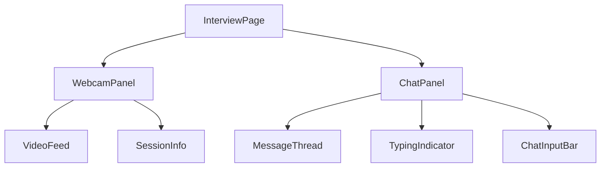
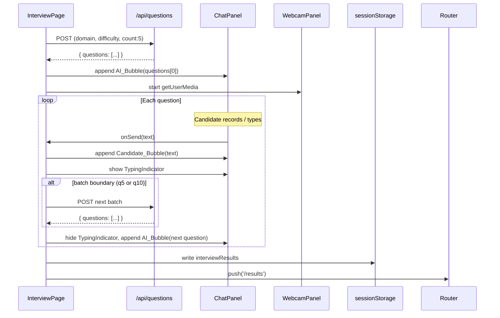

# Design Document: interview-chat-ui

## Overview

This design covers the full visual and structural redesign of `PrepHire/src/app/interview/page.tsx`. The page is transformed from a single-question card layout into a split-screen chat UI that mimics a real video interview. The left panel shows the candidate's live webcam feed with session metadata; the right panel renders the interview as a scrolling chat thread. All existing logic — Web Speech API transcription, question batch fetching, session timer, results navigation, and prepare-page settings — is preserved exactly as-is, just reorganized into the new layout.

No new routes, API endpoints, or backend changes are introduced.

---

## Architecture

The redesign is a single-file change: `PrepHire/src/app/interview/page.tsx`. To keep the file manageable, the page is decomposed into focused sub-components defined in the same file (or extracted to `PrepHire/src/components/interview/` if the file grows too large).



State lives entirely in `InterviewPage` and is passed down as props. No external state library is needed — React `useState` and `useRef` are sufficient, matching the existing implementation's approach.

---

## Components and Interfaces

### InterviewPage (root)

Owns all state. Renders the two-column split layout and the top-bar with the "End Interview" button. Delegates webcam and chat concerns to child components.

```tsx
interface InterviewPageState {
  prepareData: PrepareData | null;
  questions: string[];
  currentIndex: number;
  responses: string[];
  messages: ChatMessage[];
  inputText: string;
  isRecording: boolean;
  isTypingIndicatorVisible: boolean;
  sessionTimeLeft: number;
  fetchedBatches: number;
  loadingQuestions: boolean;
  loadError: string;
  status: 'active' | 'submitting';
}
```

### WebcamPanel

Handles `getUserMedia`, renders the `<video>` element, and shows session metadata.

```tsx
interface WebcamPanelProps {
  domain: string;
  difficulty: string;
  questionCount: number;
  sessionTimeLeft: number;
}
```

Internally manages:
- `streamRef: React.MutableRefObject<MediaStream | null>`
- `cameraError: boolean` — set to `true` if `getUserMedia` is denied or throws

On mount: calls `navigator.mediaDevices.getUserMedia({ video: true, audio: false })` and assigns the stream to the `<video>` element's `srcObject`. On unmount: stops all tracks via `stream.getTracks().forEach(t => t.stop())`.

### ChatPanel

Renders the message thread, typing indicator, and input bar.

```tsx
interface ChatPanelProps {
  messages: ChatMessage[];
  inputText: string;
  isRecording: boolean;
  isTypingIndicatorVisible: boolean;
  onInputChange: (text: string) => void;
  onMicToggle: () => void;
  onSend: () => void;
  onSkip: () => void;
}
```

### MessageThread

A `div` with `overflow-y: auto` that renders each `ChatMessage`. Uses a `bottomRef` with `scrollIntoView({ behavior: 'smooth' })` triggered whenever `messages` changes.

### TypingIndicator

Three animated dots rendered as an AI_Bubble. Shown when `isTypingIndicatorVisible` is `true`.

```tsx
// Three dots with staggered CSS animation-delay
<div className="flex gap-1">
  <span className="dot" style={{ animationDelay: '0ms' }} />
  <span className="dot" style={{ animationDelay: '150ms' }} />
  <span className="dot" style={{ animationDelay: '300ms' }} />
</div>
```

### ChatInputBar

Fixed bottom bar with a textarea (or single-line input), a Mic button, a Send button, and a Skip link.

```tsx
interface ChatInputBarProps {
  value: string;
  isRecording: boolean;
  onChange: (text: string) => void;
  onMicToggle: () => void;
  onSend: () => void;
  onSkip: () => void;
}
```

---

## Data Models

### ChatMessage

```ts
interface ChatMessage {
  id: string;           // crypto.randomUUID() or Date.now().toString()
  role: 'ai' | 'candidate';
  text: string;
  timestamp: number;    // Date.now()
}
```

Messages are stored in the `messages: ChatMessage[]` state array in `InterviewPage`. This array is append-only during a session and is never persisted — only `responses: string[]` is written to `sessionStorage` for the results page, preserving the existing contract.

### PrepareData (unchanged)

```ts
interface PrepareData {
  domain: string;
  hasResume: boolean;
  difficulty: 'easy' | 'moderate' | 'hard';
  questionCount: 5 | 10 | 15;
  interviewType: 'dsa' | 'audio';
}
```

### InterviewResults (unchanged)

```ts
interface InterviewResults {
  domain: string;
  difficulty: string;
  questions: string[];
  responses: string[];
  date: string;
}
```

---

## Layout Specification

```
┌─────────────────────────────────────────────────────────────┐
│  Navigation bar (existing)          [End Interview]          │
├──────────────────────┬──────────────────────────────────────┤
│                      │                                       │
│   WebcamPanel        │   ChatPanel                          │
│   (40% width)        │   (60% width)                        │
│                      │                                       │
│  ┌────────────────┐  │  ┌───────────────────────────────┐   │
│  │  <video>       │  │  │  MessageThread (scrollable)   │   │
│  │  feed          │  │  │                               │   │
│  └────────────────┘  │  │  [AI bubble]                  │   │
│                      │  │       [Candidate bubble]      │   │
│  AI Interviewer      │  │  [AI bubble]                  │   │
│  Connected           │  │  [TypingIndicator...]         │   │
│                      │  └───────────────────────────────┘   │
│  Domain: ...         │                                       │
│  Difficulty: ...     │  ┌───────────────────────────────┐   │
│  Questions: ...      │  │  ChatInputBar (fixed bottom)  │   │
│                      │  │  [textarea] [🎤] [Send] Skip  │   │
│  ⏱ MM:SS            │  └───────────────────────────────┘   │
└──────────────────────┴──────────────────────────────────────┘

Mobile (< 768px): WebcamPanel stacks above ChatPanel, full width.
```

### Color Tokens

| Token       | Value     | Usage                                  |
|-------------|-----------|----------------------------------------|
| background  | `#2C2B30` | Page background, candidate bubble text |
| card        | `#4F4F51` | AI bubble background, webcam card bg   |
| accent      | `#F58F7C` | Candidate bubble bg, mic active, timer |
| secondary   | `#F2C4CE` | AI Interviewer badge, secondary labels |
| text        | `#D6D6D6` | Body text, AI bubble text              |

---

## State Flow



---

## Correctness Properties

*A property is a characteristic or behavior that should hold true across all valid executions of a system — essentially, a formal statement about what the system should do. Properties serve as the bridge between human-readable specifications and machine-verifiable correctness guarantees.*

### Property 1: Message bubble styling by role

*For any* `ChatMessage` in the thread, if its `role` is `'ai'` the rendered bubble should be left-aligned with background `#4F4F51` and text color `#D6D6D6`; if its `role` is `'candidate'` the rendered bubble should be right-aligned with background `#F58F7C` and text color `#2C2B30`.

**Validates: Requirements 3.2, 3.3**

### Property 2: Empty input cannot be submitted

*For any* string composed entirely of whitespace (including the empty string), the Send button should be disabled and no `Candidate_Bubble` should be appended to the thread when that string is the current input value.

**Validates: Requirements 4.6**

### Property 3: Message thread auto-scrolls on append

*For any* message appended to the `messages` array, the `MessageThread` container's scroll position should be at its maximum (`scrollTop === scrollHeight - clientHeight`) after the React render cycle completes.

**Validates: Requirements 3.4**

### Property 4: Responses array round-trip

*For any* session with `questionCount` ∈ {5, 10, 15} and any sequence of answer submissions (including skips and early termination via "End Interview"), the `responses` array written to `sessionStorage` under `interviewResults` should contain exactly `questionCount` entries, where each entry is either the submitted text or an empty string.

**Validates: Requirements 5.5, 6.2**

### Property 5: Typing indicator visibility invariant

*For any* answer submission event, the `isTypingIndicatorVisible` flag should be `true` from the moment of submission until the next AI bubble is appended to `messages`, and `false` at all other times during a session.

**Validates: Requirements 3.6, 5.4**

### Property 6: PrepareData values rendered in webcam panel

*For any* valid `PrepareData` object read from `sessionStorage`, the `WebcamPanel` should render the `domain`, `difficulty`, and `questionCount` values visibly in the panel.

**Validates: Requirements 2.4**

### Property 7: Session timer format

*For any* integer value of `sessionTimeLeft` in the range [0, 2700] (max 45 minutes), the formatted string displayed in the `WebcamPanel` should match the pattern `MM:SS` with zero-padded seconds.

**Validates: Requirements 2.5**

### Property 8: Camera denial does not block interview

*For any* session where `getUserMedia` rejects (permission denied or API unavailable), the interview should remain fully functional — questions load, answers can be submitted, and the session completes normally without throwing an unhandled error.

**Validates: Requirements 2.2**

---

## Error Handling

| Scenario | Behavior |
|---|---|
| `sessionStorage` has no `prepareData` | Redirect to `/prepare` immediately on mount |
| `/api/questions` returns error or empty array | Show error message in `#F58F7C`, render "Go Back" button to `/prepare` |
| `getUserMedia` denied | Show placeholder + "Camera unavailable" text; interview continues unblocked |
| `getUserMedia` not supported (non-HTTPS or old browser) | Same as denied — graceful degradation |
| Session timer hits 0 | Auto-submit current partial answer, write results, navigate to `/results` |
| Page unmount / navigation away | Clear session timer interval, stop all webcam tracks |
| Speech recognition not available | Mic button is hidden or disabled; text input remains available |

---

## Testing Strategy

### Unit Tests

Focus on pure logic functions and specific examples:

- `formatTime(s)` returns correct `MM:SS` strings for boundary values (0, 59, 60, 3599)
- `advance()` correctly appends to `responses` and increments `currentIndex`
- `advance()` at the last question writes `interviewResults` to `sessionStorage` with the correct shape
- Redirect to `/prepare` when `prepareData` is absent from `sessionStorage`
- "End Interview" button writes partial results and navigates to `/results`
- Skip records an empty string for the current question index
- Session timer reaching 0 triggers auto-submit and navigation (mocked with `jest.useFakeTimers`)
- `getUserMedia` rejection renders "Camera unavailable" placeholder (mocked `navigator.mediaDevices`)
- Loading state renders animated dots while questions are fetching
- Error state renders error message and "Go Back" button when fetch fails

### Property-Based Tests

Use **fast-check** (compatible with the Next.js/TypeScript/Jest stack — `npm install --save-dev fast-check`). Each test runs a minimum of 100 iterations.

```
// Feature: interview-chat-ui, Property 1: message bubble styling by role
// Feature: interview-chat-ui, Property 2: empty input cannot be submitted
// Feature: interview-chat-ui, Property 3: message thread auto-scrolls on append
// Feature: interview-chat-ui, Property 4: responses array round-trip
// Feature: interview-chat-ui, Property 5: typing indicator visibility invariant
// Feature: interview-chat-ui, Property 6: PrepareData values rendered in webcam panel
// Feature: interview-chat-ui, Property 7: session timer format
// Feature: interview-chat-ui, Property 8: camera denial does not block interview
```

Property 1 — generate random `ChatMessage` objects with arbitrary `role` and `text`, render the `MessageThread`, assert each bubble has the correct alignment class and inline style colors matching its role.

Property 2 — generate arbitrary whitespace-only strings (using `fc.stringOf(fc.constantFrom(' ', '\t', '\n'))`), assert the send button's `disabled` attribute is `true` for all of them.

Property 4 — generate random `questionCount` values from `fc.constantFrom(5, 10, 15)` and random answer sequences (mix of non-empty strings and empty strings for skips), run them through the `advance` logic, assert the written `responses` array has exactly `questionCount` entries.

Property 5 — generate random sequences of submit events, assert the `isTypingIndicatorVisible` flag transitions correctly: `true` immediately after submit, `false` after the next AI bubble is appended.

Property 6 — generate random `PrepareData` objects with arbitrary `domain`, `difficulty`, and `questionCount`, render `WebcamPanel`, assert all three values appear in the rendered output.

Property 7 — generate random integers in [0, 2700] using `fc.integer({ min: 0, max: 2700 })`, assert `formatTime(n)` matches `/^\d{2}:\d{2}$/` for all inputs.
